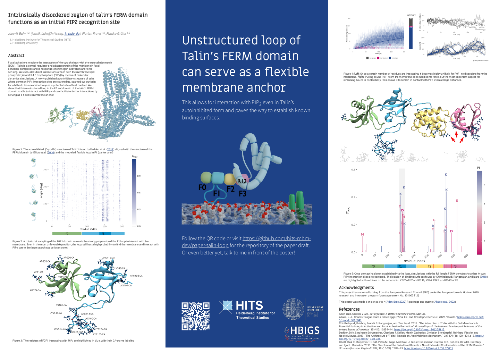

# Intrinsically disordered region of talin’s FERM domain functions as an initial PIP2 recognition site

Read the paper draft here: <https://hits-mbm-dev.github.io/paper-talin-loop>

You can find the poster for this paper presented at the [Annual Meeting of the Biophysical Society 2022](https://www.biophysics.org/2022meeting#)
in your favorite format here: [html](./poster-bps-2022.html), [pdf](./poster-jannik-buhr-bps-2022.pdf)

