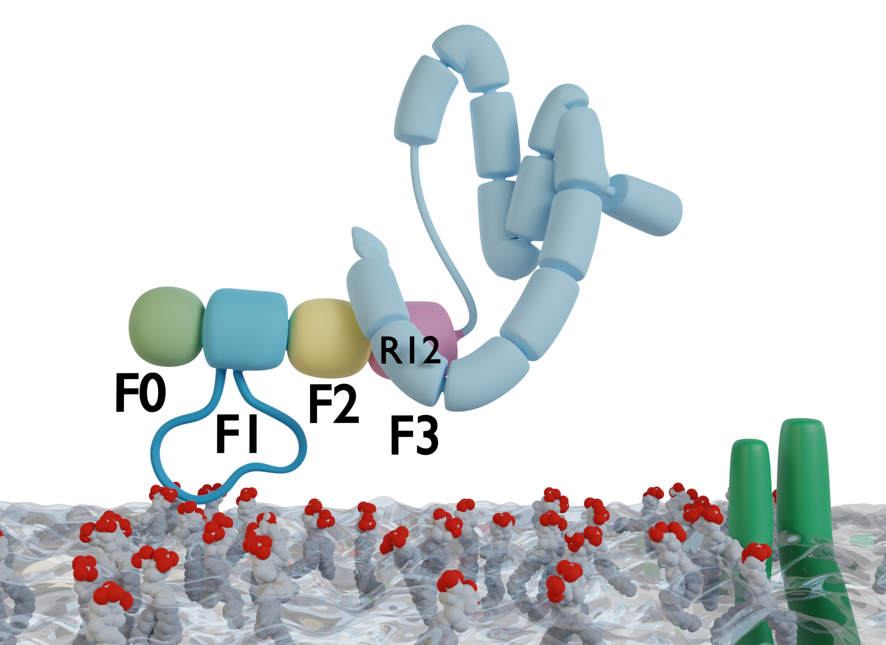

<!-- TODO: -->
<!-- - move integrin tails out of the spotlight in graphical -->
<!--   abstract and highlight loop-membrane interactions -->
<!-- - add protein representation of binding pip2 sites for FERM -->
<!--   and highlight recovery of known sites with arrows -->
<!-- - check text size of plots with A0 print reference -->

{.logo #logo-hits}
{.logo #logo-hbigs}
{.logo #logo-uni-hd}

# Unstructured loop of Talin's FERM domain can serve as a flexible membrane anchor

This allows for interaction with PIP~2~ even in Talin's autoinhibited form
and paves the way to establish known binding surfaces.

<!-- # The **F1 loop** of the focal adhesion protein Talin can function as a flexible **membrane anchor** and perform initial PIP~2~ **recognition**. -->

:::{.call-to-action}
Follow the QR code or visit <https://github.com/hits-mbm-dev/paper-talin-loop>
for the repository of the paper draft. Or even better yet, talk to me in front of
the poster!
:::

<!-- 
 -->
<!-- {width=30%} -->
<!-- {width=30%} -->
<!-- {width=30%} -->
<!-- 
 -->

## Abstract

{.wrapping}

Focal adhesions mediate the interaction of the cytoskeleton with the extracellular matrix (ECM).
Talin is a central regulator and adaptorprotein of the multiprotein focal adhesion complexes and is responsible for integrin activation and force-sensing.
We evaluated direct interactions of talin with the membrane lipid phosphatidylinositol 4,5-bisphosphate (PIP~2~) by means of molecular dynamics simulations.
A newly published autoinhibitory structure of talin, where common PIP~2~ interaction sites are covered up, sparked our curiosity for a hitherto less examined loop as a potential site of first contact.
We show that this unstructured loop in the F1 subdomain of the talin1 FERM domain is able to interact with PIP~2~ and can facilitate further interactions by serving as a flexible membrane anchor.

<!-- ## Setup -->

<!--  -->

<!-- ## Rotational sampling reveals prominent loop--membrane interactions -->

{width=80% .center}

{width=80% .center}

<!-- # Extra Tables & Figures -->

<!-- ## Heading 2 -->

{width=50%}
{width=50%}

**Left**: Once a certain number of residues are interacting, it becomes highly unlikely for F0F1 to dissociate from the membrane. **Right**: Pulling bound F0F1 off of the membrane does need some force, but the most important aspect for remaining bound is its flexibility. This allows it to remain in contact with PIP~2~ over a long period of time during pulling.

<!-- {width=60% .center} -->

<!--  -->

## Acknowledgments

This project has received funding from the European Research Council (ERC) under the European Union’s Horizon 2020 research and innovation program (grant agreement No. 101002812)

This poster was made possible by the `knitr` [@knitr]
and `betterposter` [@rbetterposter] R packages.

# References
